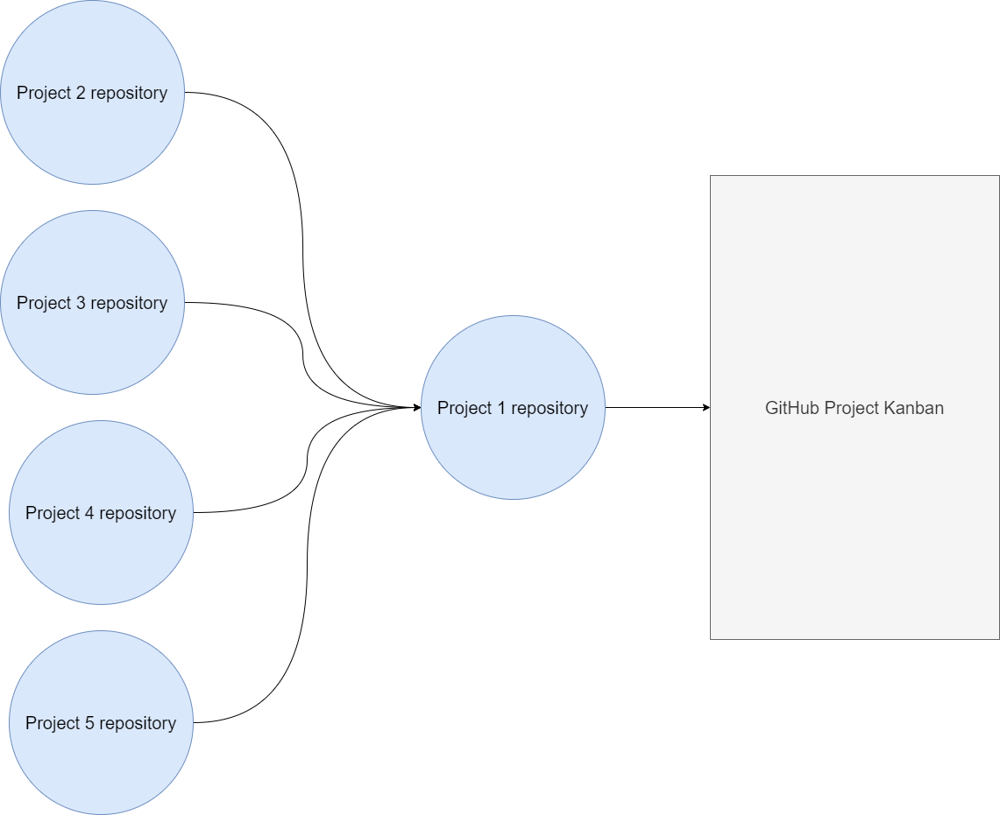
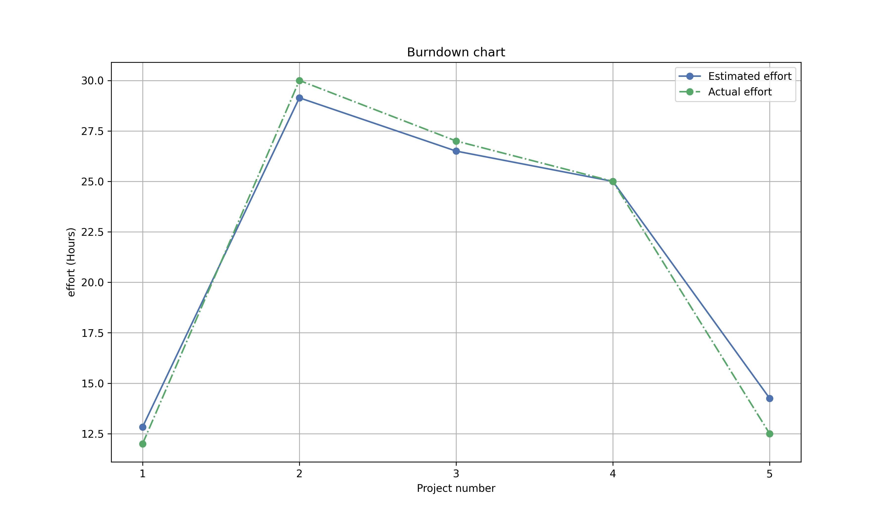

# CMPG-323-Overview-35553367

This repository contains an overview of all the repositories, for the project in CMPG 323 course

# Project repositories

Each repository created for the projects will use the following name scheme

```
CMPG-323-{Project_name}-35553367
```

The links to all the project repositories can be found below, please note that these links will be updated as new projects are created

- [Project 1](https://github.com/aaryadevg/CMPG-323-Overview-35553367)
- [Project 2](https://github.com/aaryadevg/CMPG-323-Project-2-35553367) **Private**
- Project 3
- Project 4
- Project 5

This project will act as a central repository for all projects, this repository will also link to the Github project for the semester which will all project repositories to link to the Github project board, as illustrated in the diagram below

# Diagrams



# Branching Strategies

A branch is a concept within version control systems which allows developers to work on different features or bug fixes in parallel without affecting the main (master) branch.

for all of the project within this course I will make use of the following branching strategy

## Main (Master) branch

The main (master branch) will be the default branch for each project and will contain the major releases for the project.

## Development branch

The development branch will contain new features still in development for the project, this brach will periodically be merged into the master branch, as new features are ready and tested.

## Bug Fixes branch

The bug fixes branch will have a collection of bug fixes, which will be merged into the feature branch and therefore eventually into the master branch, refer to the diagram below.


# Gitignore file

A gitignore file, contains a list of files that should be ignored by git, which means that changes made to these files will not be tracked

for the project the following files will be ignored

- Visual Studio solution files
- log files
- cache files
- Credentials for any APIs used and connection strings for databases
- appsettings.json

# Storage of credentials

Credentials and other sensitive information will **NOT** be stored in this repository ASP.net Core makes use of a JSON (JavaScript Object Notation) file which contains configuration information and connection strings all credentials will be stored in this file, the file will not be stored on GitHub (Because of the Gitignore).

# The Burn down chart

The burn down chart shows an the estimated number of hours per project compared to the actual time take to complete the project. Please note that the actual number of hours cannot be tracked as of the time of writing
thus these values are made up



The estimated number of hours per project is determined by considering the time allocated by the semester schedule and the estimated time for the required badges and time spent in class using the following formula:

```
effort = AllocatedTime - (BadgesCompletionTime + ClassTime)
```

The script used to calculate the estimated time per project is saved in the "Utils" directory

## Extra Note

I decided to make use of a per project basis for the burn down chart, because it would be easier to calculate
the estimated number of hours spent per project than estimated number of hours per sprint, and the effort put into each project is the end goal in my opinion
