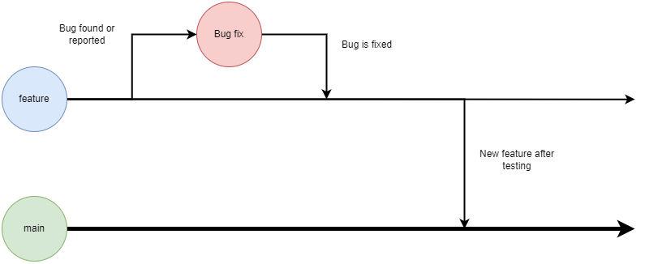

# CMPG-323-Overview-35553367

This repository contains an overview of all the repositories, for the project in CMPG 323 course

# Project repositories

Each repository created for the projects will use the following name scheme

```
CMPG-323-{Project_name}-35553367
```

The links to all the project repositories can be found below, please note that these links will be updated as new projects are created

- [Project 1](https://github.com/aaryadevg/CMPG-323-Overview-35553367)
- Project 2
- Project 3
- Project 4
- Project 5

# Diagrams

# Branching Strategies

A branch is a concept within version control systems which allows developers to work on different features or bug fixes in parallel without affecting the main (master) branch.

for all of the project within this course I will make use of the following branching strategy

## Main (Master) branch

The main (master branch) will be the default branch for each project and will contain the major releases for the project.

## Development branch

The development branch will contain new features still in development for the project, this brach will periodically be merged into the master branch, as new features are ready and tested.

## Bug Fixes branch

The bug fixes branch will have a collection of bug fixes, which will be merged into the master branch and the feature branch, refer to the diagram below.


